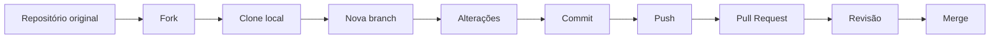

<div align="center">

# 🤝 Contribuição Open Source com Git e GitHub

Laboratório prático sobre colaboração em projetos open source, criação de branches, commits, forks e Pull Requests utilizando Git e GitHub.


</div>

---

## 📌 Sobre o projeto

Este repositório foi utilizado em um laboratório prático sobre colaboração em projetos open source por meio do GitHub.

A atividade faz parte da formação da **Digital Innovation One — DIO** e tem como objetivo apresentar o fluxo básico de contribuição utilizado em projetos colaborativos.

Durante o laboratório, são praticadas etapas como:

* criação de um fork;
* clonagem de um repositório;
* configuração de repositórios remotos;
* criação de branches;
* edição de arquivos Markdown;
* preparação das alterações;
* criação de commits;
* envio de alterações ao GitHub;
* abertura de Pull Requests.

O repositório funciona como um ambiente educacional para compreender como diferentes desenvolvedores podem colaborar com um mesmo projeto sem alterar diretamente o repositório principal.

---

## 🎯 Objetivos de aprendizagem

Os principais objetivos deste laboratório são:

* compreender o conceito de software open source;
* conhecer o fluxo de colaboração do GitHub;
* aprender a criar e utilizar forks;
* trabalhar com branches independentes;
* compreender a diferença entre `origin` e `upstream`;
* criar commits organizados;
* enviar alterações para um repositório remoto;
* abrir um Pull Request;
* utilizar Markdown para criar documentação;
* compreender o processo básico de revisão de contribuições.

---

## 🌐 O que é open source?

Open source é um modelo de desenvolvimento no qual o código-fonte de um projeto fica disponível para consulta, uso, modificação e colaboração, de acordo com os termos de sua licença.

Isso permite que desenvolvedores possam:

* estudar como um software funciona;
* identificar e corrigir problemas;
* propor novas funcionalidades;
* melhorar a documentação;
* criar traduções;
* testar alterações;
* compartilhar conhecimento com a comunidade.

Um projeto ser público no GitHub não significa automaticamente que qualquer uso é permitido. As permissões de uso, modificação e distribuição são determinadas pela licença adotada pelo projeto.

---

## 🔄 Fluxo de contribuição praticado

O fluxo básico trabalhado no laboratório pode ser representado da seguinte forma:



---

## 🧩 Etapas do laboratório

### 1. Criação do fork

O fork cria uma cópia do repositório original dentro da conta do participante.

Essa cópia permite realizar alterações sem modificar diretamente o projeto principal.

---

### 2. Clonagem do repositório

Após criar o fork, o repositório pode ser clonado para o computador:

```bash
git clone https://github.com/ONestoDev/dio-lab-open-source.git
```

Depois da clonagem:

```bash
cd dio-lab-open-source
```

---

### 3. Configuração do upstream

O repositório clonado normalmente possui um remote chamado `origin`, que aponta para o fork.

Para acompanhar as mudanças do projeto original, pode ser adicionado outro remote chamado `upstream`:

```bash
git remote add upstream https://github.com/digitalinnovationone/dio-lab-open-source.git
```

Para verificar os repositórios remotos configurados:

```bash
git remote -v
```

---

### 4. Atualização do fork

As alterações mais recentes do projeto original podem ser obtidas com:

```bash
git fetch upstream
```

Depois, a branch local pode ser atualizada:

```bash
git checkout main
git merge upstream/main
```

Outra possibilidade é:

```bash
git pull upstream main
```

O uso de `fetch` seguido de `merge` torna as duas etapas explícitas, enquanto `pull` realiza ambas em uma única operação.

---

### 5. Criação de uma branch

Antes de realizar a contribuição, deve ser criada uma branch específica:

```bash
git checkout -b feat/community/ONestoDev
```

Em versões mais recentes do Git, também pode ser utilizado:

```bash
git switch -c feat/community/ONestoDev
```

A branch isola as alterações e evita que o trabalho seja realizado diretamente na `main`.

---

### 6. Criação ou alteração de arquivos

O desafio propõe a criação de um perfil em Markdown dentro da pasta `community`.

Exemplo:

```text
community/ONestoDev.md
```

Esse arquivo pode conter informações como:

* apresentação pessoal;
* tecnologias estudadas;
* projetos;
* links profissionais;
* estatísticas do GitHub;
* objetivos de carreira.

---

### 7. Preparação das alterações

Para verificar os arquivos alterados:

```bash
git status
```

Para adicionar o arquivo à área de preparação:

```bash
git add community/ONestoDev.md
```

---

### 8. Criação do commit

Após preparar as alterações:

```bash
git commit -m "feat: add ONestoDev profile"
```

Uma boa mensagem de commit deve explicar de forma direta o que foi alterado.

---

### 9. Envio da branch

A branch pode ser enviada para o fork hospedado no GitHub:

```bash
git push origin feat/community/ONestoDev
```

---

### 10. Abertura do Pull Request

Depois do push, é possível abrir um Pull Request comparando:

```text
Fork e branch do participante
                ↓
Repositório e branch principal
```

O Pull Request permite que os responsáveis pelo projeto:

* visualizem as alterações;
* comentem o código;
* solicitem ajustes;
* aprovem a contribuição;
* realizem o merge.

---

## 🧠 Conceitos praticados

### Fork

Cópia de um repositório criada dentro de outra conta do GitHub.

O fork mantém uma relação com o projeto original, mas é administrado separadamente.

### Clone

Cópia local do repositório, utilizada para editar os arquivos no computador.

### Branch

Linha independente de desenvolvimento.

Branches permitem desenvolver alterações sem comprometer imediatamente a versão principal do projeto.

### Commit

Registro de uma alteração no histórico do Git.

Um commit possui informações como:

* autor;
* data;
* mensagem;
* arquivos modificados;
* estado do projeto naquele momento.

### Pull Request

Solicitação para incorporar alterações de uma branch em outra.

Apesar do nome, um Pull Request não é apenas um pedido para “baixar” código. Ele funciona como um espaço de revisão, discussão e integração de mudanças.

### Merge

Operação que integra as alterações de uma branch em outra.

### Remote

Referência para um repositório hospedado remotamente.

Os nomes mais comuns são:

| Remote     | Finalidade                                      |
| ---------- | ----------------------------------------------- |
| `origin`   | Repositório do qual o projeto local foi clonado |
| `upstream` | Repositório original associado a um fork        |

---

## 🛠️ Tecnologias e ferramentas

| Tecnologia           | Aplicação                                |
| -------------------- | ---------------------------------------- |
| Git                  | Controle de versão distribuído           |
| GitHub               | Hospedagem e colaboração em repositórios |
| Markdown             | Criação dos perfis e documentação        |
| Git Bash ou terminal | Execução dos comandos                    |
| VS Code              | Edição dos arquivos                      |

---

## 📁 Estrutura geral do repositório

```text
dio-lab-open-source/
│
├── community/
│   └── perfis dos participantes
│
├── docs/
│   └── arquivos de documentação
│
├── utils/
│   └── recursos para personalização dos perfis
│
└── README.md
```

A pasta `community` concentra os perfis criados pelos participantes, enquanto as demais pastas fornecem documentação e recursos auxiliares.

---

## 📝 Comandos utilizados

```bash
# Clonar o fork
git clone https://github.com/ONestoDev/dio-lab-open-source.git

# Entrar na pasta
cd dio-lab-open-source

# Adicionar o repositório original
git remote add upstream https://github.com/digitalinnovationone/dio-lab-open-source.git

# Atualizar as referências remotas
git fetch upstream

# Criar uma branch
git switch -c feat/community/ONestoDev

# Verificar alterações
git status

# Preparar o arquivo
git add community/ONestoDev.md

# Criar o commit
git commit -m "feat: add ONestoDev profile"

# Enviar a branch
git push origin feat/community/ONestoDev
```

---

## ✅ Boas práticas de contribuição

Antes de abrir um Pull Request, é importante:

* ler o `README.md`;
* verificar se existe um arquivo `CONTRIBUTING.md`;
* analisar as issues abertas;
* respeitar o padrão do projeto;
* criar uma branch específica;
* evitar mudanças não relacionadas;
* escrever commits claros;
* revisar as próprias alterações;
* descrever corretamente o Pull Request;
* responder aos comentários da revisão.

---

## ⚠️ Erros comuns

### Trabalhar diretamente na branch `main`

Isso dificulta a separação das alterações e pode gerar conflitos.

A melhor prática é criar uma branch específica para cada contribuição.

### Não configurar o upstream

Sem o `upstream`, o fork pode ficar desatualizado em relação ao projeto original.

### Criar um Pull Request com alterações desnecessárias

Arquivos temporários, configurações pessoais do editor e mudanças não relacionadas devem ser evitados.

### Copiar o perfil de outro participante

Outros arquivos podem ser usados como referência visual, mas o conteúdo deve representar o próprio participante.

### Utilizar mensagens de commit genéricas

Mensagens como `update`, `alteração` ou `arquivo novo` não explicam adequadamente o histórico.

Prefira mensagens como:

```text
docs: update contributor profile
feat: add ONestoDev profile
fix: correct profile links
```

---

## 📚 Aprendizados desenvolvidos

Durante este laboratório foram praticados:

* fundamentos de Git;
* fluxo de trabalho distribuído;
* gerenciamento de branches;
* sincronização entre fork e projeto original;
* resolução básica de diferenças entre repositórios;
* criação de commits;
* envio de alterações;
* construção de documentação com Markdown;
* abertura de Pull Requests;
* colaboração em comunidades técnicas;
* boas práticas de contribuição.

---

## 🗺️ Possíveis evoluções

Como continuidade dos estudos, este laboratório pode ser complementado com:

* contribuições em projetos reais;
* abertura e resolução de issues;
* revisão de Pull Requests;
* resolução de conflitos de merge;
* uso de `git rebase`;
* assinatura de commits;
* criação de templates para issues;
* criação de templates para Pull Requests;
* estudo de licenças open source;
* uso de GitHub Actions;
* participação em projetos da comunidade.

---

## 🎓 Contexto educacional

Projeto desenvolvido durante o laboratório **Contribuindo em um Projeto Open Source no GitHub**, oferecido pela **Digital Innovation One — DIO**.

O repositório foi mantido como registro do aprendizado sobre Git, GitHub, Markdown e colaboração em projetos open source.

---

## 👨‍💻 Autor

Laboratório realizado por **Ernesto — ONestoDev**.

[](https://github.com/ONestoDev)

---

## 📄 Créditos e licença

O laboratório original e os materiais de apoio foram desenvolvidos pela **Digital Innovation One — DIO**.

Este fork possui finalidade educacional. As condições de uso e distribuição devem seguir a licença adotada pelo repositório original.
